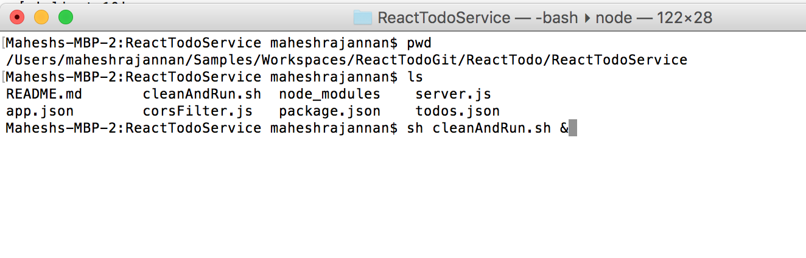
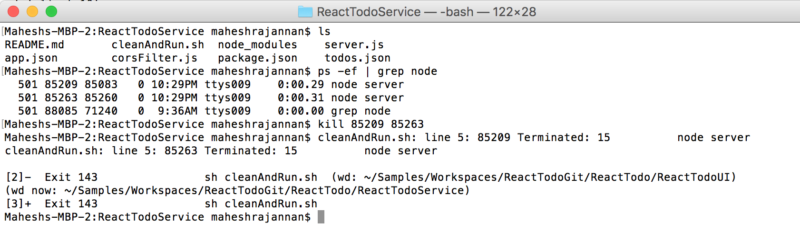
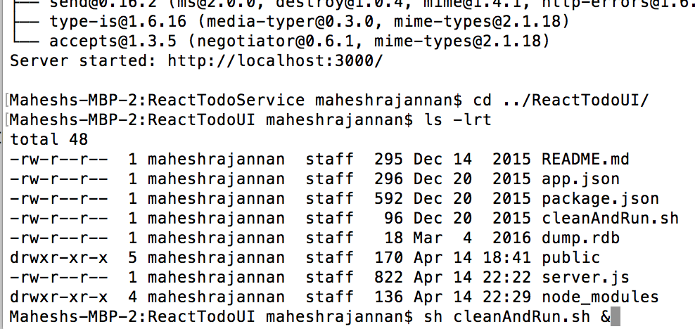
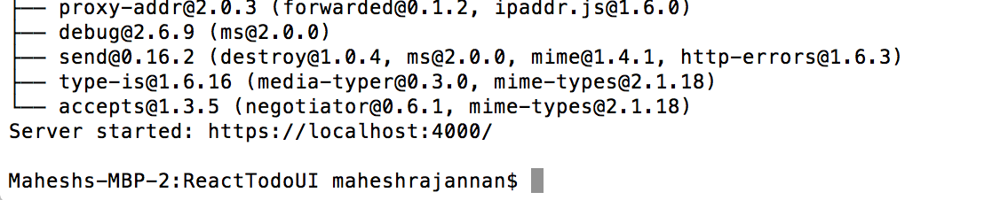

1. First start the service.

2. Kill any existing node processes to avoid port conflict.

3. Start UI

Screen Shot 2018-04-15 at 9.38.04 AM.png

4. Check The Port

Screen Shot 2018-04-15 at 9.37.46 AM.png

